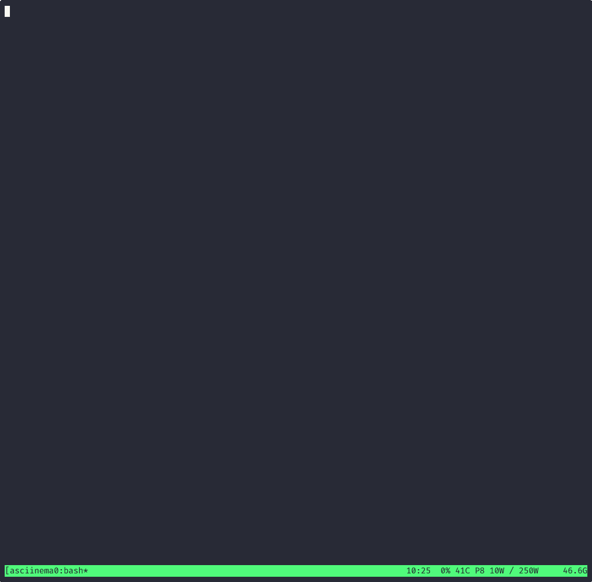

# local-aider
This repo is just an attempt to collect scripts and notes on how one
can enable using [aider](https://aider.chat) with a local reasoning "architect" model (Qwen/QwQ-32B)
and a non-reasoning "editor" model (Qwen/Qwen2.5-Coder-Instruct-32B)
on a single consumer-grade GPU (tested on RTX 3090).

I should mention that the simplest solution is probably to use the [Ollama support in
aider](https://aider.chat/docs/llms/ollama.html), the approach here however, allows you (in
principle) to experiment with different backends (such as [vLLM](https://github.com/vllm-project/vllm), [ExllamaV2+tabbyAPI](https://github.com/theroyallab/tabbyAPI), ...).


## Usage
```console
$ mkdir brainstorming-repo
$ cd brainstorming-repo
$ git init .
$ ./bin/local-model-enablement-wrapper \
    aider \
        --architect --model litellm_proxy/local-qwq-32b \
        --editor-model litellm_proxy/local-qwen25-coder-32b
```
<details>
<summary>A less "magical" approach would be to launch the compose file manually.</summary>

In one terminal:
```console
$ podman compose up --build --force-recreate
[pod-llama-cpp-swap] | llama-swap listening on :8686
[pod-litellm-proxy]  | INFO:     Started server process [1]
[pod-litellm-proxy]  | INFO:     Waiting for application startup.
[pod-litellm-proxy]  | INFO:     Application startup complete.
[pod-litellm-proxy]  | INFO:     Uvicorn running on http://0.0.0.0:4000 (Press CTRL+C to quit)
...
```
and then in another terminal, launch aider as usual, but make sure you export the relevant
environment variables:
```console
$ env \
    LITELLM_PROXY_API_BASE="http://localhost:4000" \
    LITELLM_PROXY_API_KEY=sk-deadbeef0badcafe \
    aider \
        --architect --model litellm_proxy/local-qwq-32b \
        --editor-model litellm_proxy/local-qwen25-coder-32b
```

</details>

## Customization
Everything in this repo is probably subject to customization. If you
want to increase the verbosity of the logging (e.g. trouble-shooting) 
you can adjust these settings:
```console
grep -E '(logRequests|detailed_debug)' -R .
./compose.yml:      host-litellm.py --config /root/litellm.yml --detailed_debug
./config-llamacpp-container.yaml:logRequests: true
```

## Challenges
- The 32B parameter models fit in 24GB VRAM, but only one at a time, solution:
  [llama-swap](https://github.com/mostlygeek/llama-swap)
- The easiest way to run the models is using llama.cpp's Docker image. But llama-swap has a problem
  stopping the container when unloading a model, solution: run llama-swap
  [inside](env-llama-cpp-swap/Containerfile) llama.cpp's server container.
- `aider` relies on [litellm](https://github.com/BerriAI/litellm) for routing model selection to
  different backends. litellm relies on 'openai/' prefix to indicate OpenAI compatible API
  endpoint. And while `litellm` offers [custom
  prompts](https://web.archive.org/web/20250214140648/https://docs.litellm.ai/docs/completion/prompt_formatting#format-prompt-yourself)
  as well as taking prompts from huggingface config files, there are two problems: the former does
  not have an effect when the prefix is `openai/` (I submitted [a
  PR](https://github.com/BerriAI/litellm/pull/9390) to address this here) the latter requires a
  `huggingface/` prefix which unfortunately changes the request format to that of huggingface's API
  which is not OpenAI compatible (as far as I can tell). Workaround: I use a patched litellm (from
  the PR) for now.
-   

## TODOs
- [ ] the prompt template might not be working quite right, looking at the logs, and responses, \n\n
      might not be correctly escaped, I see occurrences of "nn" and "nnnn"
- [ ] litellm proxy does not seem to propagate request interruption

# Demo
[](https://asciinema.org/a/Rm1PSQHtEEtEIyhKOsO2KbcYX)
or view the full cast using asciinema player
[here](https://asciinema.org/a/Rm1PSQHtEEtEIyhKOsO2KbcYX).

# Miscellaneous
- Aider needs to be [informed about context window
  size](https://aider.chat/docs/config/adv-model-settings.html#context-window-size-and-token-costs),
  you may copy/append `.aider.model.metadata.json` to your $HOME directory (or the root of your git
  repo in which you intend to run aider).
- The health-check query, in the wrapper-script gives some delay when launching the script, set
  LOCAL_AIDER_USE_HEALTH_CHECK=1 to opt-in to its use.
- Best practice is to run aider in a sandboxed environment (executing LLM generated code is
  risky). We can replace the aider call with e.g "podman run ..." or "docker run ...". At this
  point, an alias might come in handy:
```console
$ grep aider-local-qwq32 ~/.bashrc
alias aider-local-qwq32="env local-model-enablement-wrapper contaider --architect --model litellm_proxy/local-qwq-32b --editor-model litellm_proxy/local-qwen25-coder-32b"
```
  this alias uses a utility script to launch aider in a container
  ([contaider](https://github.com/bjodah/contaider)).
- [ ] we could perhaps use "python -m exllamav2.server --model ... --top-k ..." etc with llama-swap
      [like this](https://www.reddit.com/r/LocalLLaMA/comments/1gzm93o/comment/lz1mvrf/?utm_source=share&utm_medium=web3x&utm_name=web3xcss&utm_term=1&utm_content=share_button)
      ```
models:
  "qwen-coder-32b-exl2":
    env:
      - "CUDA_VISIBLE_DEVICES=0"
    cmd: >
      python -m exllamav2.server
      --model /path/to/Qwen2.5-Coder-32B-exl2_4.0bpw
      --port 9503
      --context-length 32000
      --temperature 0.1
      --top-k 50
      --top-p 0.9
    proxy: "http://127.0.0.1:9503"
      ```
  Better than tabbyAPI configured with litellm.yml? I don't know.
